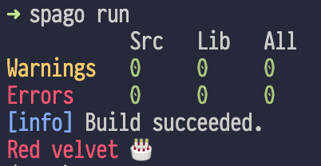
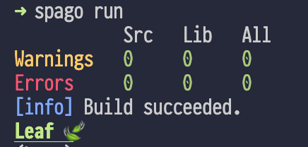
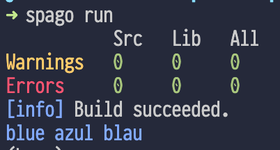
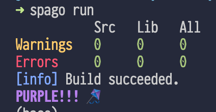

# 🎷 purescript-lazy-joe 🦥

Zero boilerplate ffi for purescript. 

For these days when you got the blues and are just too lazy to write ffi code. 

## ToC
* [Installation](#installation)
* [Quickstart](#quickstart)
* [Usage](#usage)
    * [Method chaining](#method-chaining)
    * [Uncurried functions](#uncurried-functions)
    * [Vararg functions](#vararg-functions)
    * [Scoped functions](#scoped-functions)
    * [Effectful functions](#effectful-functions)
    * [`new` constructor](#new-constructor)
* [Credits](#credits)

## Installation

```
spago install lazy-joe
```

## Quickstart

```
main :: Effect Unit
main = launchAff_ do
  { red } <- fromDefault "chalk" -- import a module
  log $ red "Red velvet 🎂" -- use a function
```

## Usage

Imagine we want to use the amazing [`chalk`](https://github.com/chalk/chalk) js library for terminal styling in our purescript code. 

We start by installing chalk.
```
npm install chalk
```

`chalk` defines a number of functions and combinators that allow you to write coloured text to your terminal. For instance the function `red` from `chalk` prints a red string. In js you would use it like this:

```js
import chalk from 'chalk';

console.log(chalk.red("Red velvet 🎂"));
```

Let's see how we can ffi this in our purescript code:

```purescript
main :: Effect Unit
main = launchAff_ do
  { red } <- fromDefault "chalk"
  log $ red "Red velvet 🎂"
```
Running it will print:





You can easily import the `default` export from a module using `fromDefault`. This will type red as `String -> String`.

### Method chaining

In js method chaining is often used. 


#### Example

In chalk, you can combine different styles by chaining:

```js
import chalk from 'chalk';

console.log(chalk.underline.bold.green('Leaf 🍃'));
```

In purescript, we can use function application to model this method chaining:
```purescript
main :: Effect Unit
main = launchAff_ do
  { underline } <- fromDefault "chalk"
  log $ underline # \{ bold } -> bold # \{ green } -> green "Leaf 🍃"
```

Running it will print:

.

### Uncurried functions

js typically uses uncurried functions (e.g. `f(a,b,c) `) instead of uncurried functions (e.g. `f(a)(b)(c)` ) like purescript. Use `curried` to use the uncurried js function as a curried purescript function:

```
result = curried myFunc arg1 arg2 arg3
```

#### Example

E.g. we can use the `blue` function as a three-argument uncurried function:

```js
console.log(chalk.blue('blue', 'azul', 'blau'));
```

In purescript functions are curried, so we need to uncurry them using `curried`:

```purescript
main :: Effect Unit
main = launchAff_ do
  { blue } <- fromDefault "chalk"
  
  log $ curried blue "blue" "azul" "blau"
```

Running it will print: 



### Vararg functions

js functions are sometimes designed to be variadic, i.e. to have a variable number of arguments. Use `variadic myModuleOrFunc func` for functions that accept varargs:

```purescript
let 
  example1 = variadic func arg1
  example1 = variadic func arg1 arg2 arg3
  example1 = variadic func [arg1, arg2, arg3, arg4]
```

#### Eample

In fact, the colour methods in `chalk` are variadic methods (as you have seen in the previous example) and you can pass an arbitrary number of arguments:
```js
console.log(chalk.blue('Hello', 'world!', 'Hola', 'mundo!'));
```

If we need this variadic behaviour, we can use `variadic` to model this: 
```purescript
main :: Effect Unit
main = launchAff_ do
  { blue } <- fromDefault "chalk"
  
  log $ variadic blue "Hello"
  log $ variadic blue "Hello" "world!"
  log $ variadic blue [ "Hello", "world!", "Hola", "mundo!"]
```

### Scoped functions

Sometimes js functions don't work in purescript, because they internally use `this` which fails to resolve in a curried contex. Use `scoped myModuleOrFunc func` you to make a function scoped:

```purescript
result <- scoped myModuleOrFunc func arg1 arg2
```

#### Example

Simply using the `rgb` function from `chalk` as we did before will fail because it uses `this` internally. To make it work again we will need to set the scope for the function to the module: 

```purescript
main :: Effect Unit
main = launchAff_ do
  m@{ rgb } <- fromDefault "chalk"
  
  log $ scoped m (curried rgb) 129 37 218 # \{ bold } -> bold "PURPLE!!! 🪁"
```

Running it will print:



### Effectful functions

js functions very often cause side-effects (e.g. like printing to the console). Use `effectful` you to catch these side-effects and return `Effect` instead:

```purescript
let
  result :: Effect SomeResult 
  result = effectful func arg1 arg2
```

#### Example

Let's try another example and install minimalistic http-client `got`:

```console
npm install got
```

With `got` we can create a simple http request using the `post` function and passing a url and a json body:
```js
import got from 'got';

const {data} = await got.post('https://httpbin.org/anything', {
	json: {
		hello: '🌎'
	}
}).json();

console.log(data);
```

Clearly, `post` is an effectful function, as it triggers a promise. So in purescript `post` will have the signature `Effect (Promise json)` which we can then be converted to an `Aff` using the `toAffE`.

```purescript
main :: Effect Unit
main = launchAff_ do
  { post } <- fromDefault "got"
  resp <- Promise.toAffE $ effectful (uncurried post) "https://httpbin.org/anything" { json: { hello: "🌎" } } >>= \{ json } -> json
  log resp.json
```

We import the `post` from `got`. The first thing we need to do is uncurry it, since it receives two arguments, the url and the json record. We then wrap it using `effectful` so that is run in an `Effect`. We can then call the effectful js function `json()` on the resulting `Promise` to get the body, so we can just `bind` (`>>=`) it.

### `new` constructor

Use `new` to create new objects:

```purescript
myModule <- fromDefault "my-module"
let myObj = new myModule arg1 arg2
```

#### Example

`fuse.js` is a library for fuzzy search. In js you use it by first creating a new `Fuse` object using `new` and passing the data as a list and some options:
```js
const fuse = new Fuse(list, options);
```
Then you can search on this object:
```js
const pattern = "my-search-pattern"
fuse.search(pattern)
```

We first import the default export from `fuse.js` which gives us the class, which we can then pass to `new` to create the `Fuse` object:

```purescript
fuse <- fromDefault "fuse.js"
  let
    list =
      [ { "title": "Old Man's War", "author": { "firstName": "John", "lastName": "Scalzi" } }
      , { "title": "The Lock Artist", "author": { "firstName": "Steve", "lastName": "Hamilton" } }
      ]
    options =
      { keys: [ "title", "author.firstName" ]
      }
  result :: Array { item :: { title :: String, author :: { firstName :: String, lastName :: String } } } <-
    (new fuse list options) # \f@{ search } -> effectful (scoped f search) "eve"

  logShow result
```

## Credits

Kudos to @paluh for writing the [`purescript-js-object`](https://github.com/paluh/purescript-js-object) library (check it out!), which basically inspired me to write this library. @paluh's library is probably the (type-)safer option, but I thought if I am already too lazy to write ffi, then I really want to be lazy and not write anything at all. So this library follows a different implementation approach to basically not require any ffi code, at the expense of more type-safety.
